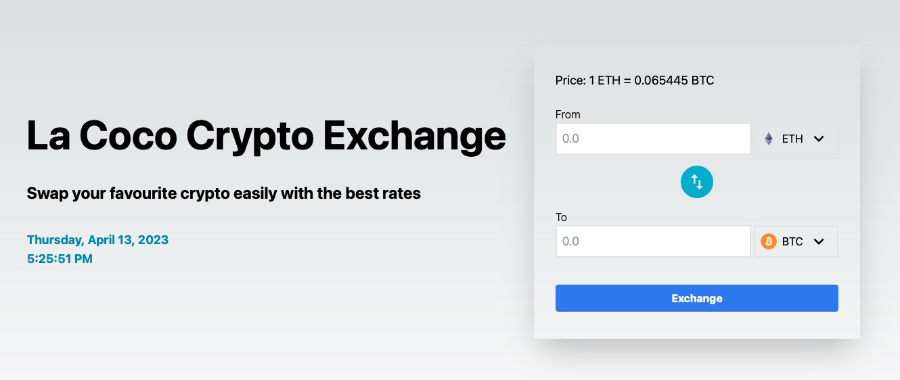

# La Coco Crypto Exchange Frontend
This single page web application is developed with Typescript, React, and NextJs

Allows user to swap popular cryptocurrencies 

Prices are updated every 10 seconds




## Getting Started
### Install packages
1. Clone this repo
2. Make sure you have `npm` installed, 
3. Open a terminal and navigate to the source folder, then run:
```
npm install
```

### Start the server
Make sure to start the backend server before this: https://github.com/yamiyukiharu/lacoco-exchange-api

Once the backend server is up, run this:
```
npm run dev
```
Once done, open `http://localhost:8000/` in your browser to start interacting with it

## Testing
Playwright is used as the end-end (e2e) testing framework

First, install playwright and the browser tools with:
```
npx playwright install
```

To run all e2e tests:
```
npx playwright test
```